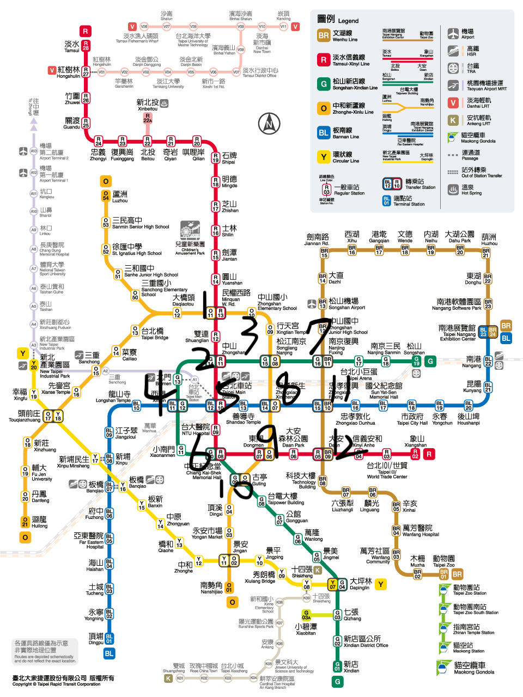

# NGLAB_Ticket_System
> A Simple Train Ticket System Exercise for NTUST NGLab

# Motivation 
- Improve one's programming skill
* Know how to use Github more proficiently
+ Learn about the flow of how to build a project
# How to clone and run the project
> clone
```
git clone  git@github.com:Jackxul/NGLAB_Ticket_System.git
```
> start
```
cd NGLAB_Ticket_System
make
./exe/start
```
>clean
```
make clean
```
>Structure
```tree .
.
├── Makefile
├── README.md
├── ref
│   └── station_map.png
└── src
    ├── Makefile
    ├── main.c
    ├── map.c
    ├── station_in.c
    └── station_out.c
```

# Station map
[ Map_reference ](https://www.metro.taipei/cp.aspx?n=91974F2B13D997F1)

> 
